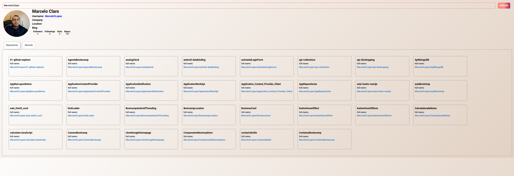

# GUITHUB REPOSITORIES API

Projeto criado durante o Bootcamp Eduzz Fullstack Developer 2 na DIO [https://www.dio.me](https://www.dio.me/), Criando um frontend totalmente componentizado na prática em ReactJS, com a instrução de Matheus Benites [https://github.com/benits](https://github.com/benits)

Projeto consiste em uma aplicação que lista os repositorios no GitHub de um usuário pesquisado.

## Tecnologias aplicadas

- axios
- react-tabs
- styled-components

---

